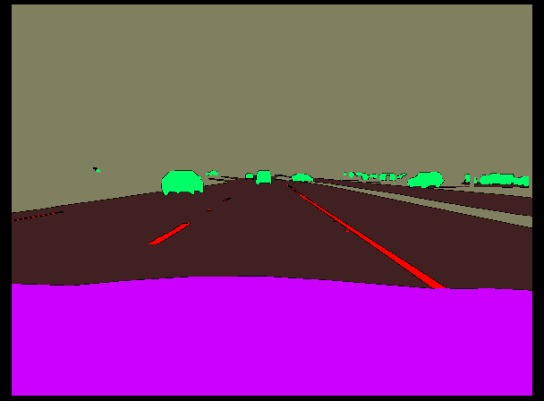

# X-E2E: Explainable End2End Learning for Autonomous Vehicle Systems

work in progress :)

in the meantime, im playing around with the semseg dataset from <a href="https://github.com/commaai/comma10k">comma</a>. Currently am getting a CE loss of 0.04 on the training set (images + masks). Let's see if I can beat the <a href="https://github.com/YassineYousfi/comma10k-baseline/tree/main">comma10k-baseline</a> ‼️

Here's a sample prediction image from the model (playing around with resnet/efficientnet encoders w/ weighted Adam optimizers + Dice Loss):

